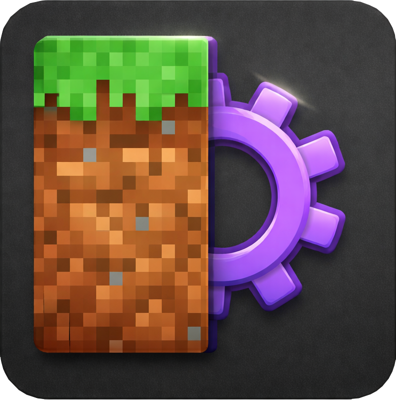

<p align="center">
  
</p>

<h1 align="center">MCFC</h1>

<p align="center">
  A statically typed language, compiler, and language server for building
  Minecraft datapacks from <code>.mcf</code> source files.
</p>

The project currently provides:

- `mcfc`, a command-line datapack compiler
- `mcfc`, a Rust library crate
- `mcfc-lsp`, a language server for editor integration
- a VS Code extension under `editors/vscode-mcfc`

MCFC targets Minecraft `26.1.2` datapacks. The language guide in
`LANGUAGE.md` is the canonical reference for syntax and behavior.

## Example

```mcfc
fn main() -> void:
    let player = single(selector("@p"))
    let bb = bossbar("mcfc:demo", "MCFC Bossbar")

    bb.value = 5
    bb.max = 10
    bb.visible = true
    bb.players = player

    player.tellraw("Bossbar will disappear soon")

    async:
        sleep(5)
        bb.remove()
        player.position.setblock("minecraft:gold_block")
```

MCFC uses indentation for block structure. The old `end` block terminator is no
longer part of the supported syntax.

## CLI Usage

Build a single source file into a datapack directory:

```powershell
cargo run -- build test.mcf --out build/pack --clean
```

Build a project from a manifest or project directory:

```powershell
cargo run -- build path/to/mcfc.toml --out build/pack --clean
```

Watch a source file or project and rebuild on every save:

```powershell
cargo run -- watch path/to/project --out build/pack --clean
```

Common flags:

- `--namespace <name>`: override the generated datapack namespace
- `--emit-ast`: write the typed program dump to `debug/typed_program.txt`
- `--emit-ir`: write the lowered IR dump to `debug/ir.txt`
- `--no-optimize`: disable the conservative IR optimization pass
- `--clean`: remove the output directory before writing generated files

The `watch` command keeps running, recompiles after `.mcf` saves, and prints
compiler diagnostics without exiting so you can fix errors and continue.

The compiler emits `pack.mcmeta`, generated functions under
`data/<namespace>/function/`, and load/tick tags when needed.

## Language Highlights

- functions with typed parameters and return types
- integer, boolean, string, array, dictionary, struct, entity, block, bossbar,
  item, NBT, and scoreboard-backed state values
- `if`, `match`, `while`, range `for`, and selector `for`
- `as(...)` and `at(...)` context composition
- raw Minecraft commands with `mc`
- macro commands with `mcf`
- non-blocking `async:` blocks with `sleep(...)` and `sleep_ticks(...)`
- special `tick()` functions that compile to the datapack tick entrypoint
- public wrappers for no-argument `void` functions so they can be run with
  `/function <namespace>:<function_name>`

See `LANGUAGE.md` for the full guide.

## Project Manifests

Project builds can use `mcfc.toml` or `*.mcfc.toml` manifests. Supported fields
include:

- `namespace`
- `source_dir`
- `asset_dir`
- `out_dir`
- `load` and `tick` function tags
- `[[export]]` mappings from datapack paths to MCFC functions

The compiler supports both single-file builds and manifest-based project
builds.

## Development

Run these commands from the repository root:

```powershell
cargo fmt -- --check
cargo test -q
cargo build
cargo build --bin mcfc-lsp
```

Manual smoke test:

```powershell
cargo run -- build test.mcf --out build/pack --clean
```

VS Code extension commands are run from `editors/vscode-mcfc`:

```powershell
npm install
npm run compile
npm run package
```

There is currently no `npm test` script for the VS Code extension.

## Repository Layout

- `src/cli.rs`: CLI entrypoint logic
- `src/compiler.rs`: high-level compile pipeline
- `src/lexer.rs`, `src/parser.rs`, `src/ast.rs`: frontend
- `src/types.rs`, `src/analysis.rs`: type checking and analysis
- `src/ir.rs`, `src/optimizer.rs`: lowering and optimization
- `src/backend.rs`: datapack generation
- `src/project.rs`: manifest discovery and project file collection
- `src/lsp.rs`: language server implementation
- `tests/integration.rs`: main regression suite
- `editors/vscode-mcfc/`: VS Code extension
- `LANGUAGE.md`: language reference

## Status

MCFC is early-stage software. Generated datapack output and language features
are actively evolving, so pin commits when using it for a project.
