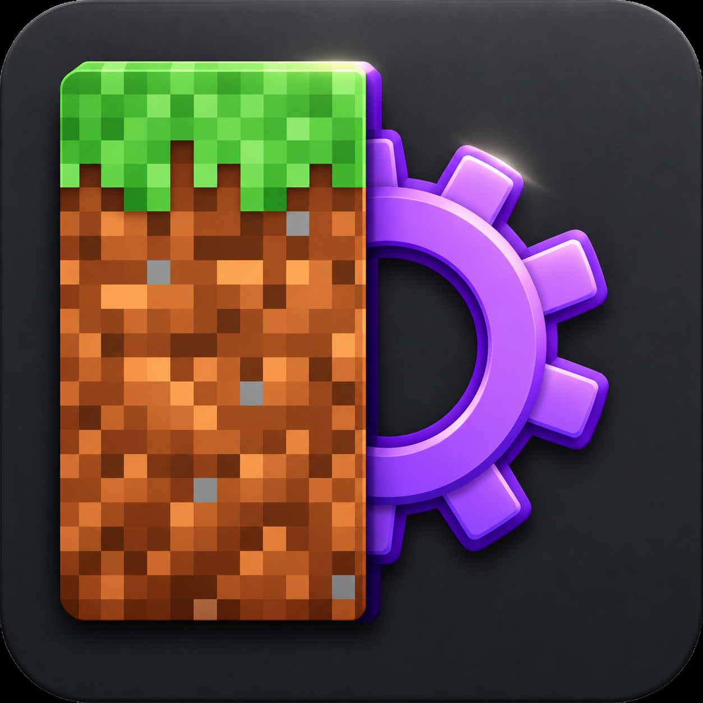

<p align="center">
  
</p>

<h1 align="center">MCFC</h1>

<p align="center">
  A statically typed language that compiles <code>.mcf</code> source into
  vanilla Minecraft 26.3 datapacks, with a language server for VS Code.
</p>

```mcfc
@PlayerState("Coins")
int coins;

@Every(ticks = 20)
void payday() {
    for (Player player : Selector.of("@a")) {
        player.state.coins = player.state.coins + 1;
        player.actionbar("Coins: $(player.state.coins)");
    }
}

@Command("buy")
void buy(Player player) {
    if (player.state.coins >= 10) {
        player.state.coins = player.state.coins - 10;
        player.give("minecraft:diamond", 1);
    }
}
```

## Install

```powershell
cargo install --path .
mcfc new my-pack --helper none
mcfc build my-pack --clean
```

Copy `my-pack/dist` into `<world>/datapacks/` and run `/reload`.

## Documentation

The docs are a VitePress site under [`docs/`](docs/). Run `npm install` and then `npm run docs:dev` to browse them locally.

- [Your First Pack](docs/guide/first-pack.md) is a 15-minute tutorial.
- [Cookbook](docs/guide/cookbook.md) has recipes for common tasks.
- [Language Tour](docs/language/tour.md) covers the whole language on one page.
- [Reference](docs/language/reference/statements.md) covers statements, types, builtins, events and std.
- [Host Bridge](docs/runtime/host-bridge.md) covers HTTP, files and SQLite through the optional `mcfd` helper.

## Repository

| Path | What |
| --- | --- |
| `src/` | Compiler, CLI and language server (`mcfc`, `mcfc-lsp`) |
| `std/` | The `std` library, written in MCFC |
| `tests/` | Regression suite |
| `examples/` | Runnable packs |
| `mcfd/`, `mcfd-agent/` | Optional host helper and Java agent |
| `editors/vscode-mcfc/` | VS Code extension |
| `docs/` | Documentation site |

See [Contributing](docs/development/contributing.md) for the checks to run before committing.

MCFC is early-stage. Syntax and output change between commits, so pin a commit for any pack you depend on.
